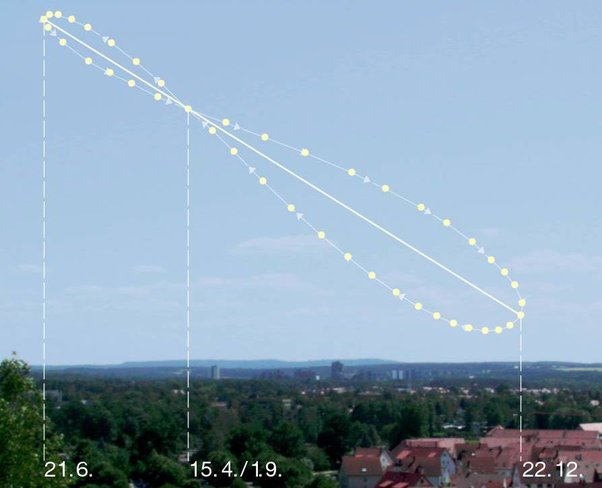

*Réponse publiée [sur Quora](https://fr.quora.com/Puisque-tout-mouvement-est-relatif-pourquoi-est-il-faux-de-dire-que-le-Soleil-tourne-autour-de-la-Terre/answer/Dr-Goulu)*

Quelque petites remarques anodines pour commencer :

1. si le Soleil a l'air de tourner autour de la Terre chaque jour, ce n'est pas parce que la Terre tourne autour du Soleil, mais parce que la Terre tourne sur elle-même …
2. on ne voit pas facilement que la Terre tourne autour du Soleil le jour, mais plutôt la nuit : on remarque que les étoiles ne sont pas à la même place chaque nuit, mais "bougent" avec un cycle d'une année.
3. en traçant la position du soleil dans le ciel à heure fixe au cours d'une année, on trouve une forme bizarre, l'[Analemme](w:)

(analemme du Soleil en Allemagne à 9h du matin, source : Wikipedia)

Cela dit, je peux effectivement affirmer que le trou noir central de la Voie Lactée tourne autour de mon nombril selon des équations [Cinématiques](w:Cinématique) x(t), y(t), et z(t) que je pourrais même écrire avec une certaine précision au prix d'un certain boulot.

> En [physique](w:), la **cinématique** (du grec *kinêma*, le mouvement) est l'étude des mouvements indépendamment des causes qui les produisent (Wikipedia)

Le problème c'est que ces équations seront très très compliquées et non réutilisables si je veux calculer la trajectoire de Titan autour de mon nombril par exemple.

Par contre, si je décompose les mouvements des astres selon une hiérarchie étrangement établie selon les masses décroissantes ([Superamas de la Vierge](w:), [Groupe local](w:), [Sagittarius A*](w:), Soleil, Terre, Philippe, nombril) je constate que :

1. les équations du mouvement d'un objet "léger" dans le référentiel de l'objet "lourd" immédiatement au dessus dans la hiérarchie sont étrangement simples : trajectoire elliptique et rotation de l'objet "léger" sur lui même.
2. ceci permet de facilement calculer le mouvement de n'importe quel objet A par rapport à n'importe quel objet B en "remontant" de A au nœud commun C entre A et B dans la hiérarchie et en redescendant à B
3. que ces équations résultent directement de la [Dynamique](w:Dynamique_(mécanique))"qui étudie les corps en mouvement sous l'influence des [actions mécaniques](w:Action_mécanique) qui leur sont appliquées. (Wikipedia)" en l'occurrence la gravitation universelle (avec un soupçon de relativité par ci par là)

Pour résumer rapidement :

- vous pouvez dire que le Soleil tourne autour de la Terre si ça vous chante, il ignore tout des maths. Mais n'oubliez pas de mettre l'analemme et la durée du jour dans vos équations pour ressentir bien profondément les [plaisirs du géocentrisme,](w:Géocentrisme) sinon c'est pas du jeu
- la Terre continuera a tourner autour du Soleil pour des raisons physiques, les seules qui importent. Et en prime, les calculs sont plus simples…
