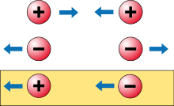

*Réponse publiée [sur Quora](https://fr.quora.com/Existe-t-il-ou-pourrait-il-exister-un-objet-avec-une-masse-négative/answer/Dr-Goulu)*

Voir le lien fourni.

> Une masse inertielle négative signifierait inversement qu'il faut fournir de l'énergie au système pour le ralentir, ou symétriquement, que le système fournit de l'énergie à son environnement en accélérant. Par exemple, un objet avec une masse inertielle négative accélérerait dans la direction opposée à celle vers laquelle il est poussé ou freiné. Une telle particule de masse inertielle négative serait par conséquent un projectile précieux : il fournit de l'énergie lorsqu'on lui donne une [impulsion](w:Quantité_de_mouvement) au départ, accélère sous l'effet des frottements de l'air, et en heurtant un obstacle tendrait donc à accélérer au travers de celui-ci, d'autant plus violemment que la résistance serait importante : un tel projectile serait donc irrésistible.
>
>
>
> **Mouvement*****runaway***
>
>
>
> 
>
>
>
> En jaune, le mouvement *runaway* décrit par Bonnor, qui pourrait être utilisé comme moyen de propulsion.
> Ici, le signe des particules réfère au type masse et non pas à la charge électrique.
