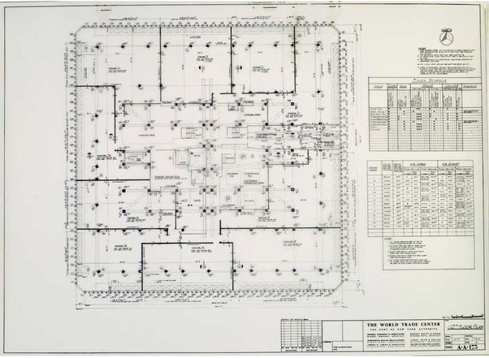

*Réponse publiée [sur Quora](https://fr.quora.com/Des-physiciens-ont-conclus-que-l-effondrement-des-tours-jumelles-du-WTC-était-dû-à-une-démolition-contrôlée-Quen-pensez-vous/answer/Dr-Goulu)*

Non. Le plan est là :

ce sont les façades qui tiennent l'ensemble, les étages étaient accrochés dessus
