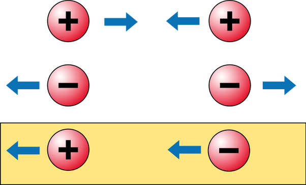

*Réponse publiée [sur Quora](https://fr.quora.com/Quelles-sp%C3%A9cificit%C3%A9s-physiques-aurait-un-objet-ayant-une-masse-n%C3%A9gative-Aurait-il-une-gravit%C3%A9-r%C3%A9pulsive/answer/Dr-Goulu)*

Pas exactement. Une [Masse négative](w:)repousserait une autre masse négative, mais serait attirée par une masse positive. Par contre, cette masse positive serait repoussée, ce qui générerait un "mouvement runaway",

Une masse négative permettrait de réaliser un moteur ne consommant pas d énergie…

Et si vous pensez à la bonne vieille formule f=m.a de Newton, un m négatif a un effet très étrange : l'objet accélère en sens inverse de la force…

Donc le frottement, force toujours dirigée en sens inverse du mouvement, ferait accélérer une masse négative.

Désolé mais ça fait beaucoup de violations de principes physiques…

[Solutions admissibles - Pourquoi Comment Combien](/2016/09/11/solutions-admissibles/)
