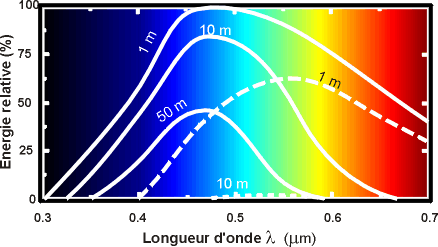

*Réponse publiée [sur Quora](https://fr.quora.com/Est-ce-que-l-eau-absorbe-les-rayons-infrarouges-si-oui-à-partir-de-combien-de-mètre-environ/answer/Dr-Goulu)*

Oui c'est juste. Trouvé [La lumière dans la mer](https://www.futura-sciences.com/sciences/dossiers/physique-milieu-marin-proprietes-physiques-416/page/6/) qui est un peu plus clair, avec cette figure notamment

À 1m,il ne reste plus que la moitié du rouge, à 10m plus rien du tout.
