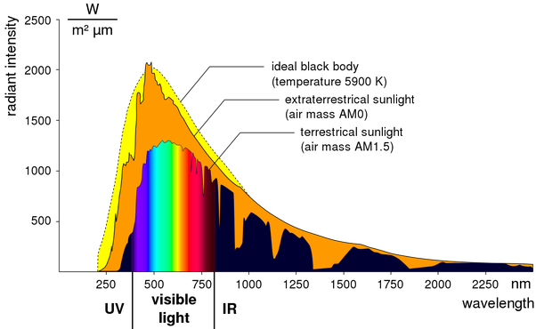

*Réponse publiée [sur Quora](https://fr.quora.com/Qu-est-ce-qu-il-y-a-de-spécial-avec-le-spectre-de-la-lumière-visible-comparée-aux-autres-spectres-Est-ce-que-nos-yeux-sont-programmés-pour-percevoir-ces-longueurs-ondes/answer/Dr-Goulu)*

Bien sur que le spectre estplus large. Mais c'est évolutivement plus utile d'être sensible dans une bande limitée que de percevoir "toutes les couleurs".

