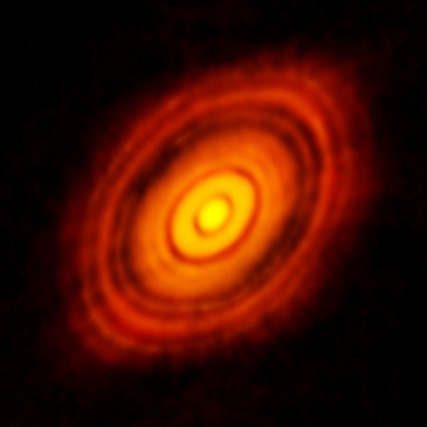

*Réponse publiée [sur Quora](https://fr.quora.com/Comment-se-fait-il-que-la-planète-Mars-possède-2-satellites-naturels-soit-plus-que-toutes-les-planètes-telluriques-réunies/answer/Dr-Goulu)*

Oui, comme tous les astres. La Terre à cette taille par hasard aussi. La [Formation du Système solaire](w:Formation_et_évolution_du_Système_solaire)a été très chaotique.

ici vous voyez le [Disque protoplanétaire](w:)de HL Tauri, un système en formation actuellement :

Vous voyez des grumeaux sur les orbites ? Ce sont des [Planétésimaux](w:Planétésimal) qui vont former des planètes, des lunes, des astéroïdes impacteurs etc. Bien malin celui qui peut dire combien de chaque type…
