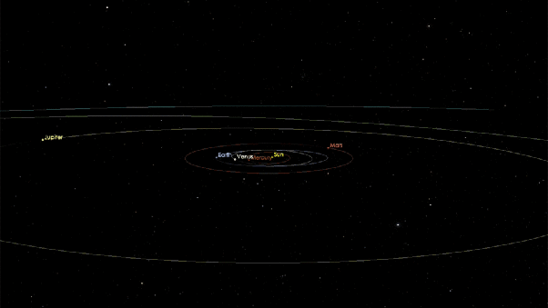

*Réponse publiée [sur Quora](https://fr.quora.com/Quel-est-le-m-s-2-dOumuamua/answer/Dr-Goulu)*

Votre question ne veut rien dire.

[1I/ʻOumuamua](w:)a une trajectoire hyperbolique. Elle est arrivé vers notre système solaire selon une direction, a été déviée par le Soleil, et est repartie dans une autre direction :

Il est arrivé avec un [excès de vitesse hyperbolique](w:Trajectoire_hyperbolique)de 26.33 km/s, a été accéléré par le Soleil, est passé au périhélie près de lui à 87.71 km/s, est reparti en se faisant décélérer par le Soleil et aura un excès de vitesse hyperbolique de 26.33 km/s en quittant le système solaire.
