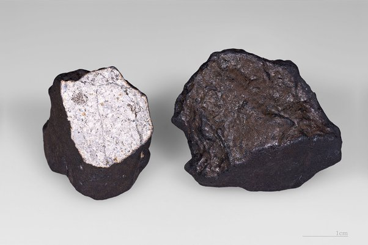

*Réponse publiée [sur Quora](https://fr.quora.com/Quelle-serait-la-masse-dune-com%C3%A8te-dont-la-glace-ne-fondrait-pas-int%C3%A9gralement-lors-de-sa-rentr%C3%A9e-dans-notre-atmosph%C3%A8re/answer/Dr-Goulu)*

L’échauffement d'une [Météorite](w:) (qui inclut celles de natures cométaire) est minime en entrant dans l'atmosphère. C'est surtout l'échauffement de l'air comprimé par l'objet qui est si élevé qu'il devient lumineux, produisant "l'étoile filante". Le frottement de l'air produit une ablation de la surface, et la chute est trop rapide pour produire un échauffement de la masse. Les météorites trouvées au sol juste après leur chute étaient juste tièdes, pas chaudes[[1]](#mLiry)

Selon [Chute de météorites : flux et risques](https://planet-terre.ens-lyon.fr/article/chute-meteorites.xml) :

> les modèles les plus récents montrent que les corps ayant une masse inférieure à 10 kg à leur arrivée au sommet de l'atmosphère terrestre seront complètement désintégrés sous la forme de leurs atomes constitutifs au cours de leur traversée (incomplète) de l'atmosphère

donc voilà : **10 kg.** Que ce soit de la glace, de la roche ou du métal ne change pas grand chose**,** si ce n'est que la pression de l'air pourrait faire éclater la glace en petits morceaux et produire une forte explosion, comme dans le cas du [Superbolide de Tcheliabinsk](w:), qui était probablement rocheux et dont on a retrouvé que de petits fragments

Sur la photo d'un de ceux-ci, on voit que la surface est effectivement noircie par le frottement/chaleur/oxydation, mais sur une très petite épaisseur, l'intérieur ne montrant aucune trace de transformation thermique :

C'est peut-être ce qui est arrivé avec un noyau cométaire lors de l'[Événement de la Toungouska](w:), où l'on a retrouvé que des fragments microscopiques.

Notes de bas de page

[[1]](#cite-mLiry)[Risques météoritiques - Pourquoi Comment Combien](https://www.drgoulu.com/2012/01/28/risques-meteoritiques/)
