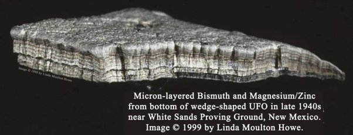

*Réponse publiée [sur Quora](https://fr.quora.com/Y-a-t-il-des-objets-que-lon-a-trouv%C3%A9s-et-qui-nont-pas-pu-%C3%AAtre-identifi%C3%A9s-par-les-scientifiques/answer/Dr-Goulu)*

Il y en a certains qu'on a pas pu identifier à l'époque de leur découverte parce qu'on avait pas les moyens techniques de le faire, mais qui ont été parfaitement compris plus tard, comme la "machine d'Anticythère" [[1]](#SLNRk)

Et il y en d'autres dont les propriétaires ne veulent pas savoir l'origine car ça casserait leurs croyances, ou leur business par exemple ça :

Dont je cause dans [I (don't) want to believe - Pourquoi Comment Combien](/2020/07/24/i-dont-want-to-believe/)

Notes de bas de page

[[1]](#cite-SLNRk)[Anticythère version suisse - Pourquoi Comment Combien](/2011/12/03/anticythere-version-suisse/)
