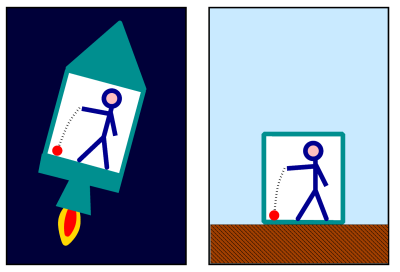

*Réponse publiée [sur Quora](https://fr.quora.com/Comment-le-fait-que-lespace-soit-courbé-fait-il-que-la-gravité-nous-tire-vers-le-bas/answer/Dr-Goulu)*

Ce n'est pas moi qui affirme que la gravitation n'est pas une force, c'est la théorie de la relativité donc toute la physique actuelle.

Le [Principe d'équivalence](w:)dit que ces deux situations sont equivalentes :

La fin de ma réponse répond à votre question : c'est l'inertie de votre sphère de plomb accélérée vers le haut par le sol qui comprime le ressort.
