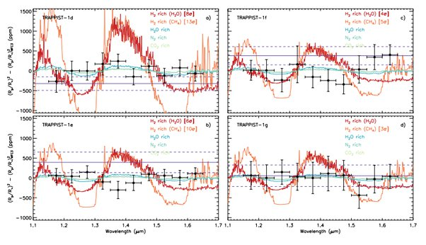

*Réponse publiée [sur Quora](https://fr.quora.com/Les-scientifiques-ont-ils-r%C3%A9ussi-%C3%A0-analyser-la-composition-de-latmosph%C3%A8re-des-plan%C3%A8tes-de-l%C3%A9toile-Trappist/answer/Dr-Goulu)*

On compare le spectre de la lumière de l'étoile avec le celui qu'on obtient lors d'un transit de la planète devant son étoile : la différence correspond aux spectre d'absorption de l'atmosphère de la planète

[Atmosphères extraterrestres — Wikipédia](w:Atmosphères_extraterrestres) liste un certains nombre de planètes dont on a pu ainsi détecter l'atmosphère avec les références scientifiques correspondantes, mais pas sur le système Trappist.

Ce qu'il y a de bien avec le système [TRAPPIST-1](w:) c'est que ses planètes orbitent très près de l'étoile, avec une période de quelques jours seulement, et que nous sommes presque parfaitement dans le plan orbital, donc nous pouvons observer beaucoup de transits. Malgré ça on voit dans le papier [Atmospheric reconnaissance of the habitable-zone Earth-sized planets orbiting TRAPPIST-1](https://arxiv.org/abs/1802.02250) que ce n'est encore un peu acrobatique d'identifier la composition des atmosphères des exoplanètes:

La figure principale de l'article montre pour chacune des exoplanètes détectées de Trappist 1 les mesures du spectre d'absorption de l'atmosphère sous la forme de "[Barres d'erreur](w:Barre_d'erreur) croisées" : les croix montrent chaque point de mesure avec son intervalle de confiance en longueur d'onde et en amplitude :

On voit qu'on n'obtient qu'une dizaine de points de mesures dans les infra rouges proches, qui sont dominants dans les spectre de cette étoile , une [naine rouge](w:) [ultra-froide](w:Naine_ultra-froide). Et assez peu précis malgré tout.

Ce qu'on fait les auteurs de l'article, c'est de simuler ce qu'on devrait obtenir avec divers types d'atmosphère (les courbes de couleur) pour déterminer le(s) type(s) compatible(s) avec les mesures. On voit que les spectres rouges et oranges correspondant à des atmosphères contenant de l'hydrogène, de la vapeur d'eau ou du méthane ne correspondent pas aux mesures, alors que des atmosphères plus froides contenant de l'eau et/ou de l'azote corespondent mieux, surtout pour les planètes d et g.

On le voit, c'est encore très approximatif, même dans des situations d'observation quasi idéales. Il faut (hélas) attendre la prochaine génération d'instruments comme [ARIEL](w:Atmospheric_Remote-Sensing_Infrared_Exoplanet_Large-survey) dans 10 ans … Et patienter d'ici là avec les prochains résultats de [CHEOPS](w:)(yololoïtou ! (= cocorico en Suisse))
