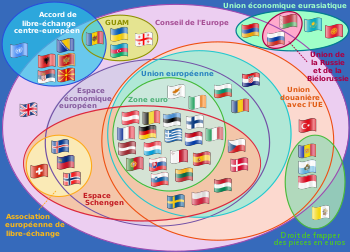

*Réponse publiée [sur Quora](https://fr.quora.com/LEurope-peut-elle-atteindre-la-suprématie-quantique/answer/Dr-Goulu)*

Pas la CEE, l'EEE. L'[Espace économique européen](w:) existe toujours.

C'est ça le problème, ami européen. Tu connais moins bien tes institutions politiques que moi ;-)

apprends ça par cœur pour la prochaine fois :

A l'époque notre propre gouvernement nous annonçait une catastrophe économique, aujourd'hui il n y a plus aucun parti politique qui oserait proposer une adhésion à l'UE…
