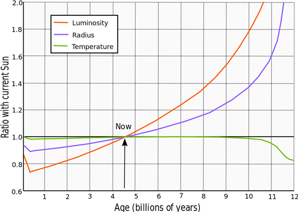

*Réponse publiée [sur Quora](https://fr.quora.com/Quest-ce-qui-attend-notre-planète-lorsque-le-Soleil-sera-en-fin-de-vie/answer/Dr-Goulu)*

Honnêtement je n'ai pas examiné les sources mais la courbe qu'on trouve sous [Soleil — Wikipédia](w:Soleil)

Montre une courbe croissante donc peut être que 7% c est sur le dernier milliard d'années et 10% sur le prochain ? J'imagine que les modèles sont validés par les nombreuses mesures d'étoiles sur la séquence principale…
