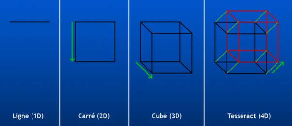

*Réponse publiée [sur Quora](https://fr.quora.com/Pouvez-vous-expliquer-la-dimension-4D/answer/Dr-Goulu)*

Mais très volontiers.

Pour commencer, en géométrie il est très facile de définir une 4ème dimension euclidienne[[1]](#gagtj) en "étirant" l'espace perpendiculairement à l'espace 3D

Si ça vous parait bizarre, dites-vous que c'est bizarre déjà pour le cube en 3D puisque votre écran ne fait que 2D, pourtant vous acceptez très bien de "projeter" un monde 3D en 2D. Pour la 4D c'est idem : on peut la projeter en 3D, qu'on peut projeter en 2D.

Ces espaces à N dimensions sont dits "euclidiens" (en raccourci…) si vous pouvez définir la distance entre deux points par la formule "de Pythagore", mais avec N coordonnées:

- en 1D $d=\sqrt{x^2}$ = x, c'est bêtement la la longueur de votre ligne
- en 2D $d=\sqrt{x^2+y^2}$ on retrouve le triangle rectangle de notre ami Pythagore
- en 3D $d=\sqrt{x^2+y^2+z^2}$ ça marche aussi dans l'espace, pas de problème
- en 4D $d=\sqrt{x^2+y^2+z^2+u^2}$si on appelle le 4ème axe u, pourquoi pas, en maths il n'y a aucun problème.

Maintenant, comme vous mentionnez la relativité, le temps etc dans les sujets de votre question, je soupçonne que vous vouliez parler de la 4ème dimension de l'[Espace-temps](w:). Là on a deux problèmes:

1. le temps se mesure dans une unité différente des 3 dimensions d'espace. On ne peut pas ajouter des secondes au carré à des mètres au carré dans la formule "de Pythagore". Ce sont des pommes et des poires.
2. à quoi diable correspond la notion de distance dans l'espace-temps ?

Albert dit:

1. pas de problème : yaka multiplier le temps par la vitesse de la lumière c pour obtenir une distance, donc je pourrais écrire $d=\sqrt{x^2+y^2+z^2+(c.t)^2}$ (et vous comprenez pourquoi j'ai appelé la 4ème dimension euclidienne u plutôt que t plus haut)
2. sauf que cette équation ne correspond à rien, et en tout cas pas à une solution de [mes géniales équations](w:Équation_d'Einstein). (c'est Albert qui parle, pour ceux qui n'auraient pas suivi…)

Mais entre la relativité restreinte qui date de 1905 et la relativité générale de 1915, Messieurs Poincaré (en 1906) et Minkowski (en 1907) se sont dits que dans l'espace-temps, on pourrait dire que la distance entre deux événements est nulle si les deux événements apparaissent simultanés, autrement dit si la lumière a eu le temps d'aller de l'un à l'autre. Et dans ce cas on a $\sqrt{x^2+y^2+z^2} = c.t$

et alors on pourrait définir la distance entre deux événements par $d=\sqrt{x^2+y^2+z^2-(c.t)^2}$

regardez bien le signe MOINS qui a remplacé le plus dans Pythagore de l'espace-temps. C'est ce qui fait que l'espace-temps n'est pas euclidien mais "[pseudo-euclidien](w:Espace_pseudo-euclidien)", plus précisément un [Espace de (Poincaré-)Minkowski](w:Espace_de_Minkowski)

Et puisque vous avez demandé ce qu'est LA dimension 4D, je vais faire un petit tour de magiemathique : ABRACA/DABRAC = AC/DC !*

$d=\sqrt{x^2+y^2+z^2+(i.c.t)^2}$

j'ai remis un signe PLUS en considérant la dimension c.t comme imaginaire !

WOW ! [Le temps est une 4ème dimension imaginaire](https://www.drgoulu.com/2007/02/07/le-temps-une-4eme-dimension-imaginaire/#.X_SVN9gVOCo) au sens mathématique du terme.

Note* : qu'est-ce que t'en dis Frédéric ?

Notes de bas de page

[[1]](#cite-gagtj)[Voir en 4 dimensions - Pourquoi Comment Combien](https://www.drgoulu.com/2007/02/06/voir-en-4-dimensions/#.X_SMZ9gVOCo)
