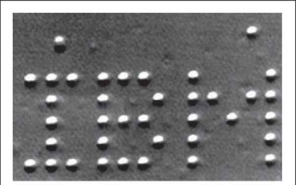

*Réponse publiée [sur Quora](https://fr.quora.com/Puisque-tout-est-compos%C3%A9-dun-nombre-fini-datomes-peut-on-cr%C3%A9er-une-imprimante-3d-capable-de-tout-reproduire-juste-en-assemblant-les-bons-atomes-nourriture-mat%C3%A9riaux/answer/Dr-Goulu)*

En théorie oui.

> En théorie il n'y a pas de différence entre la théorie et la pratique, mais en pratique il y en a une. ([Yogi Berra](w:))

Dans le cas particulier, il a deux GROS problèmes pratiques :

1. un atome c'est très petit. Il en faut le [Nombre d'Avogadro](w:) pour faire une mole de quelques grammes (12 grammes de carbone par exemple). Le Nombre d'Avogadro, c'est 600 mille milliards de milliards. Donc si votre imprimante 3D arrive à déposer un milliard d'atomes par seconde, ce qui me semble déjà vachement rapide, il lui faudra 600 mille milliards de secondes, soit 20 millions d'années pour imprimer un petit bidule d'une dizaine de grammes.
2. les liaisons chimiques qui vont se créer en déposant les atomes les uns à côté des autres ne vont pas forcément être celles que vous voulez. Par exemple si vous voulez faire une mine de crayon en graphite et que vous obtenez du diamant (les deux sont des cristaux de carbone pur) ça écrira moins bien. Et avant de vous réjouir, sachez que c'est plutôt l'inverse qui se passera (graphite à la place du diamant…)

En fait, les choses ne sont pas du tout faites en assemblant des atomes un à un. Les molécules simples se forment en grosses quantités lors de réactions chimiques qui dépendent des conditions extérieures comme la pression et la température, qui sont la conséquence de la présence d'immenses quantités de matière environnantes.

Ensuite les molécules complexes comme celles qui constituent des choses mangeables sont formées par assemblage de ces molécules simples selon des séquences bien précises (protéines formées d'acides aminés codés par l'ADN par exemple)

Donc en pratique on a réussi a déposer quelques atomes avec des microscopes à effet tunnel ou à force atomique, mais pas plus

voir [Atom/molecule manipulation](https://www.zurich.ibm.com/st/atomicmanipulation/) chez IBM Zürich qui avait fait ça en 1990 :

les points blancs sont des atomes de xénon déposés sur une surface de nickel, déposés par le [Microscope à effet tunnel](w:)inventé là bas, et "photographié" par le même appareil.
