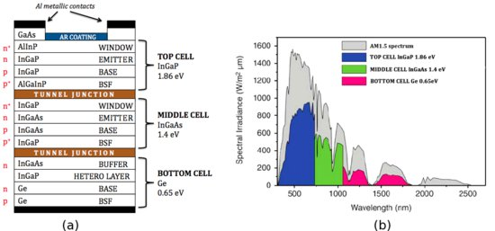

*Réponse publiée [sur Quora](https://fr.quora.com/L-énergie-à-base-de-fusion-nucléaire-sera-t-elle-disponible-dans-les-années-à-venir/answer/Dr-Goulu)*

Oui il y a(vait) beaucoup de recherche sur les cellules [de Graetzel, qui ont de la peine à passer aux great cells](https://www.drgoulu.com/2009/09/15/de-graetzel-aux-great-cells/). Leur intérêt est surtout d'être translucides, et on peut même les colorer. Il y en a tout une paroi au "Swiss Tech Convention Center" de l'EPFL. Leur problème est qu'elle se dégradent avec le temps, les UV, le gel. Un peu comme les feuilles des arbres … D'ailleurs si tu vas les voir de près, tu verras qu'elles sont probablement HS depuis le temps…

Pour le [rendement des cellules solaires](https://www.drgoulu.com/2010/05/09/comment-on-mesure-le-rendement-des-cellules-solaires/) il y a des progrès constants, par "paliers" en fonction des technologies. On arrive à 46% (en labo…) avec des [Multi-junction solar cell](w:en:Multi-junction_solar_cell)qui sont en fait des superpositions de 3 cellules rouge, vert bleu :

Actuellement ces cellules sont beaucoup plus que 3x plus chères que celles qui font 15% de rendement, donc on en revient au problème de base : c'est le prix du kWh qui fera la différence, pas le rendement
