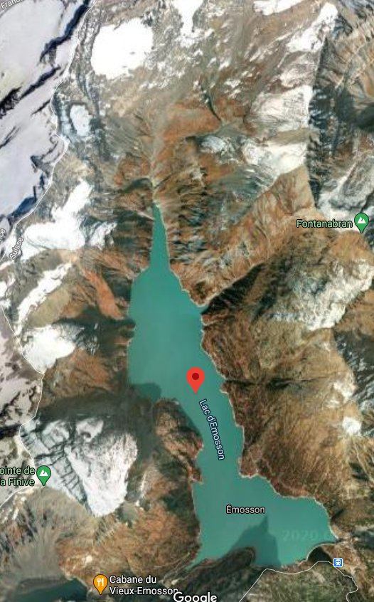

*Réponse publiée [sur Quora](https://fr.quora.com/Quand-les-glaciers-seront-enti%C3%A8rement-fondus-les-rivi%C3%A8res-de-montagne-vont-elles-sass%C3%A9cher/answer/Dr-Goulu)*

Un glacier est un stock d'eau, pas une source. La source c'est la pluie, ou plutôt la neige qui l'alimente. Donc tant qu'il pleuvra autant que maintenant, il y aura autant d'eau que maintenant.

Le problème, c'est qu'un glacier n'a pas le même comportement que le lac qui se formera peut-être à sa place. Il fonctionne avec la température. Il stocke quand il fait froid et se vide quand il fait chaud. Donc sans glacier, la rivière de montagne va avoir un débit plus important quand il pleut/neige, et moindre après une grande période de sécheresse. Donc oui, il est possible que certaines rivières s'assèchent parfois si leur glacier disparaît. Vous n'avez qu'à voir les oueds de l'Atlas …

J'ai un très bon copain qui fait de l'électricité avec ça :

Vous voyez les 4 ou 5 petits glaciers à gauche, dont les eaux se déversent dans le lac ? Quand le [Barrage d'Émosson](w:) a été construit en 1967, leur volume était supérieur à celui de l'eau dans le lac. Ils fonctionnaient comme une sorte de tampon entre la neige et le lac.

Ces dernières années, mon copain a facilement tenu ses objectifs de production parce qu'il pouvait turbiner plus d'eau que ce qui tombait en pluie+neige "grâce" à la fonte des glaciers. D'après ses calculs il devrait arriver à partir à la retraite juste quand ces 4 glaciers auront disparu, avec une prime maximum…

Son successeur devra se débrouiller seulement avec l'eau du lac, et des arrivées d'eau plus irrégulières qui le forceront peut-être à évacuer les trop-plein sans pouvoir les turbiner …
