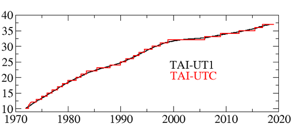

*Réponse publiée [sur Quora](https://fr.quora.com/Pourquoi-la-Terre-tourne-t-elle-plus-vite-depuis-cinq-ans/answer/Dr-Goulu)*

c'est sur l'échelle de côté : le jour varie de 1 ou 2 millisecondes par rapport au "zero". En s'accumulant, ces variations font qu'on ajoute une [Seconde intercalaire](w:) de temps en temps pour que la référence de temps officiel corresponde au temps astronomique.

En cherchant quand on a procédé aux corrections, je suis tombé sur ce graphique sur [Le laboratoire temps-fréquence de l'ORB](https://betime.be/fr/legal-time/leap-second.php) :

où on voit qu'il y en a beaucoup trop… La raison est que la définition atomique de la [Seconde](w:Seconde_(temps)) (9 192 631 770 oscillations de l'atome de cesium…) est plus courte que la seconde astronomique, ce qui donne la pente générale de la courbe. Les variations dont on parle sont les oscillations là autour
