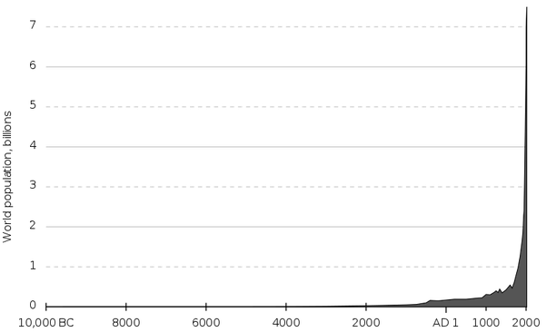

*Réponse publiée [sur Quora](https://fr.quora.com/Comment-les-scientifiques-peuvent-ils-savoir-le-nombre-dhumains-120-milliards-qui-a-v%C3%A9cu-sur-Terre-lorsquil-nen-connaissent-pas-son-origine/answer/Dr-Goulu)*

Parce qu'elle a peu d'importance.

On a trouvé des ossements d'homo sapiens âgés de 320'000 ans, mais imaginons que l'humanité ait 100'000 ans de plus. On évalue le nombre d Homo sapiens à cette époque à 50'000 à tout casser, vivant 30 ans en moyenne, donc pendant les 100'000 ans "oubliés" il y aurait eu 100'000 x 50'000 / 30 = 166 millions d'humains de plus.

Ça ne fait qu'un peu plus d'un pour mille des 120 milliards, pour un quart de l histoire de l'humanité…

Il faut bien réaliser que la [Population mondiale](w:)a augmenté comme ça :

La moitié des humains ont vécu après 1800, et environ 7% de tous les Homo Sapiens sont en vie actuellement !
