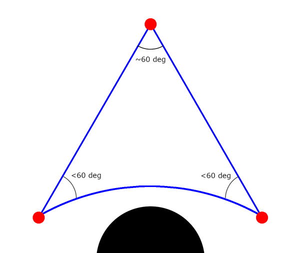
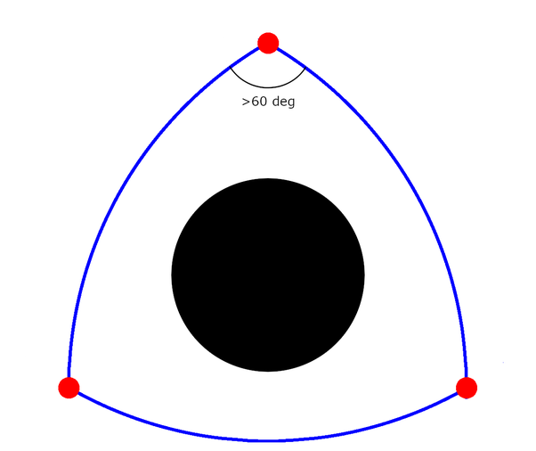

*Réponse publiée [sur Quora](https://fr.quora.com/Pourquoi-les-scientifiques-disent-ils-que-lUnivers-est-plat/answer/Duchene-Dominique)*

On sait très bien le calculer. L espace environnant un trou noir est [hyperbolique](w:Géométrie_hyperbolique), la somme des angles d'un triangle est inférieure à pi.

Mais autour du trou noir, le triangle a des angles supérieurs à pi :

[How to measure the curvature of the space-time?](https://physics.stackexchange.com/questions/109731/how-to-measure-the-curvature-of-the-space-time)
