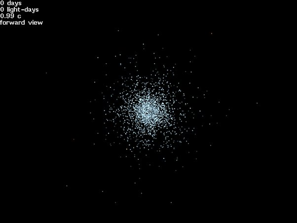

*Réponse publiée [sur Quora](https://fr.quora.com/Si-on-%C3%A9tait-dans-un-vaisseau-spatial-qui-allait-%C3%A0-une-vitesse-proche-de-celle-de-la-lumi%C3%A8re-serait-il-possible-de-voir-arriver-les-obstacles-pour-les-%C3%A9viter/answer/Dr-Goulu)*

Ce serait très difficile. A vitesse relativiste, l'espace apparaît déformé, tout est ramené devant le vaisseau

A 0.99c, tout le ciel ressemble à ça :

(source [Relativistic Starflight](https://hexadecimal.uoregon.edu/relativity/index.html)))

Il s'agit donc de détecter un objet bleu sur fond bleu… et 0.99c ça va encore, mais plus haut on cherchera un point dans un point…

A ces vitesses, même quelques atomes par m3 produisent un frottement aérodynamique et le moindre grain de sable équivaut à un bâton de dynamite. Il faudrait un bouclier très épais et massif, sur lequel il serait difficile de poser des instruments de mesure délicats.

Certains ont imaginé des "champs de force" pour dévier les petits obstacles voire les absorber comme carburant ([Tau Zéro — Wikipédia](w:Tau_Zéro)) mais je vois plutôt un gros tas d'antimatière servir de carburant, et de bouclier en annihilant tout ce qui le touche, sauf le vaisseau grâce à un joint en neutronium (patent pending)…

Bref, ça sera pas simple
