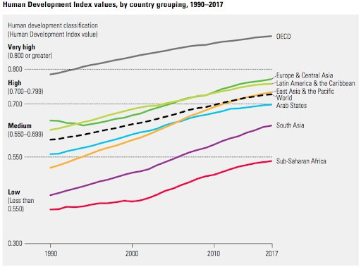

*Réponse publiée [sur Quora](https://fr.quora.com/Pourquoi-lhumanité-a-dû-passer-par-le-charbon-et-le-nucléaire-avant-de-passer-aux-énergies-renouvelables/answer/Dr-Goulu)*

D'accord. Alors prenons l'[Indice de développement humain](w:).

mon souci est qu'il continue à progresser, surtout pour ceux là en bas vers lesquels on exporte nos voitures polluantes usagées pour nous payer des Tesla …
