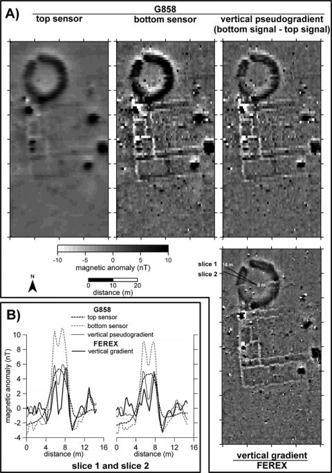

*Réponse publiée [sur Quora](https://fr.quora.com/Peut-on-mesurer-scientifiquement-linfluence-sur-le-vivant-des-ondes-li%C3%A9es-aux-champs-magn%C3%A9tiques-aux-courants-deau-souterrains-aux-r%C3%A9seaux-m%C3%A9talliques-aux-failles-g%C3%A9ologiques/answer/Dr-Goulu)*

Oui on peut, bien sur, on a aujourd'hui des instruments d'une sensibilité extraordinaire .

[Yves Rocard](w:) mentionné dans une autre réponse pensait que les sourciers sont sensibles à un milligauss, soit 0.1 microTesla (uT) . Mais aujourd'hui on a des magnétomètres un milliard de fois plus sensibles que ça[[1]](#vRPWQ) qui peuvent notamment détecter les champs magnétiques produits par l'activité des neurones.

Pour l'archéologie, les détecteurs de métaux fonctionnent très bien à l'échelle du nanotesla nT, donc 100x plus sensibles qu'un sourcier autoproclamé. Voici par exemple des mesures magnétométriques d'une villa romaine enfouie, révélée par des variations de 10 nT

( source: [What interest to use caesium magnetometer instead of fluxgate gradi...](https://journals.openedition.org/archeosciences/1781?lang=en) )

Du côté des effets, on a aussi de bons protocoles expérimentaux "en double aveugle" qui permettent d'éliminer une bonne partie des biais. Et quand on teste ainsi les sourciers, on constate qu'ils ne trouvent rien du tout , même pas des masses de métal. Donc ils ne détectent pas le milligauss / microtesla. Point.

On a aussi de très bons protocoles expérimentaux pour les tests sur le vivant, en double aveugle etc. Les expériences suggèrent que peut-être on ressent éventuellement un tout petit peu le champ magnétique terrestre qui est de 47 uT environ. Mais c'est pas sur.

Ce qui est sur, c est qu'une exposition à des champs de plusieurs Tesla, soit 20'000 fois plus dans une machine d'IRM ne nous tue pas, ne nous désoriente pas, et ne nous rend pas plus malade.

Je me suis limité aux champs magnétiques constants ou presque liés à la question , parce que le sujet des champs électromagnétiques est aussi vaste que l échelle des fréquences.

Notes de bas de page

[[1]](#cite-vRPWQ)[https://physics.nyu.edu/kentlab/...](https://physics.nyu.edu/kentlab/Lectures/Pappas_Tutorial_APSMM2008.pdf)
