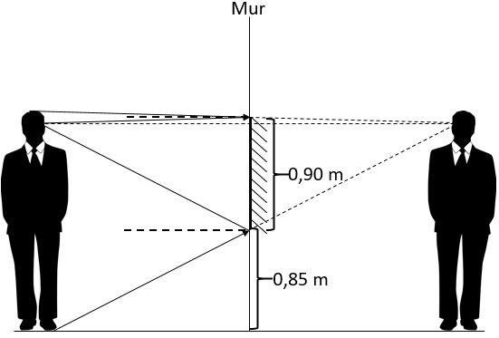

*Réponse publiée [sur Quora](https://fr.quora.com/Pourquoi-quand-l-on-regarde-dans-un-mirror-genre-pas-un-long-juste-un-mural-qui-va-pas-jusqu-au-pied-on-arrive-quand-même-à-voir-nos-pieds-alors-qu-ils-ne-sont-pas-en-face-du-miroir/answer/Christian-Franchi)*

ah je voulais répondre avec une seule image mais je n'avais pas les bons mots clés… Avec "champ d'un miroir plan" on trouve l'image à laquelle je pensais:

merci !
