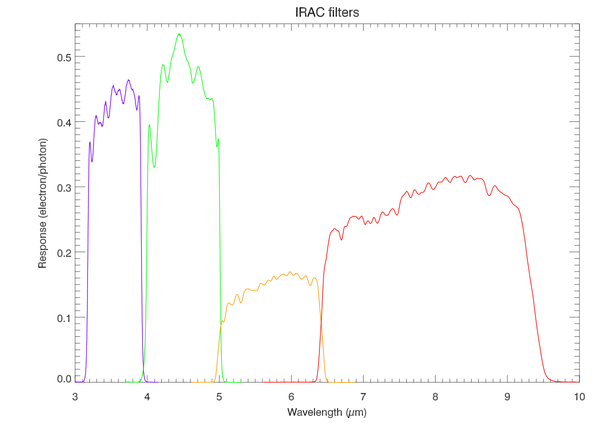

*Réponse publiée [sur Quora](https://fr.quora.com/Combien-de-photons-faut-il-pour-d%C3%A9terminer-lexistence-dun-objet-lointain/answer/Dr-Goulu)*

Peu (1…) pour le voir, beaucoup (des millions) pour savoir qu'il est lointain.

Aujourd'hui on a des capteurs sensibles à 1 seul photon, donc on verra très vite qu'il y a quelque chose.

Mais pour savoir ce que c'est, et si c'est "lointain", c'est plus compliqué.

Un objet vraiment lointain est tellement décalé vers le rouge que vous ne verrez quasiment rien dans l'optique. Il vous faudra l'observer dans l'infrarouge, ou même dans les fréquences radio avec un radiotélescope.

Et là, l'énergie des photons et la résolution des capteurs baissent dramatiquement.

Le nec plus ultra du [télescope spatial infrarouge, Spitzer](w:Spitzer_(télescope_spatial)) avait une résolution de 256x256 dans l'infrarouge proche (du visible) et de 128x128 dans l'infrarouge lointain.

Sur la page Wikipedia je viens de trouver cette intéressante figure des 4 "couleurs" de l'infrarouge proche observées par Spitzer:

L'échelle verticale est graduée en électron/photon, ce qui donne la sensibilité du capteur. On voit qu'il faut entre 10 et 2 photons pour qu'un électron bouge assez dans le capteur pour faire basculer 1 bit quelque part.

Ensuite, il faut collecter assez de photons (ou plutôt d'électrons dans le capteur…) pour pouvoir un spectre suffisamment précis pour mesurer le [Décalage vers le rouge](w:) de la source.
