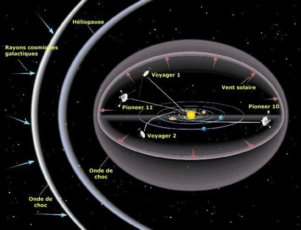

*Réponse publiée [sur Quora](https://fr.quora.com/Voyager-1-2-sont-ils-les-seules-choses-qui-ont-quitt%C3%A9-notre-syst%C3%A8me-solaire/answer/Dr-Goulu)*

Non et non.

D'abord, les sondes Voyager ne sont pas sorties du système solaire. Elles sont à un jour lumière seulement[[1]](#OIoYr) , même pas entrées dans le Nuage de Oort.

[https://www.drgoulu.com/2013/09/...](/2013/09/18/non-voyager-1-na-pas-quitte-le-systeme-solaire/)

Ensuite, les sondes Pioneer 10 et 11 sont presque aussi loin

Notes de bas de page

[[1]](#cite-OIoYr)[Voyager - Mission Status](https://voyager.jpl.nasa.gov/mission/status/)
