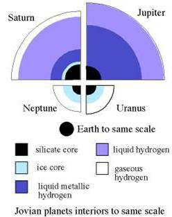

*Réponse publiée [sur Quora](https://fr.quora.com/Existe-t-il-des-g%C3%A9antes-gazeuses-ayant-un-corps-rocheux-dans-leur-centre/answer/Dr-Goulu)*

Probablement toutes. Les planètes se forment à partir du même disque protoplanétaire, donc ayant initialement la même composition. Ensuite la pression du rayonnement de l'étoile naissante repousse les éléments légers (hydrogène, hélium) vers l'extérieur du système, et le faible rayonnement thermique leur a permis de se condenser autour de noyaux rocheux.

Dans le système solaire, toutes les planètes gazeuses ont un noyau rocheux d'une taille comparable à la Terre :

[https://www.emse.fr/~bouchardon/...](https://www.emse.fr/~bouchardon/enseignement/processus-naturels/up1/web/wiki/MC - Planeto - Telluriques et Gazeuses -Biron & Padet.htm)
