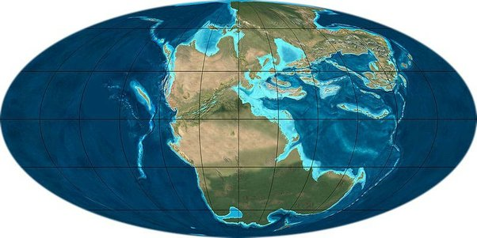
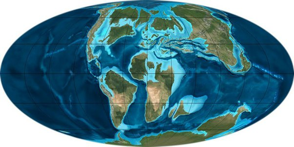

*Réponse publiée [sur Quora](https://fr.quora.com/Est-il-possible-que-les-dinosaures-soient-morts-à-cause-d-un-soudain-manque-d-oxygène/answer/Nick-Lemay-2)*

Ce ne sont pas les pôles qui bougent mais les continents.

C'est au début du Trias que l actuel Antarctique était tropical. Les zones équatoriales étaient désertiques tellement ils faisait chaud

A la fin de Crétacé, les continents ressemblaient déjà pas mal à ce qu'ils sont actuellement:

[http://www.universdesdinosaures....](http://www.universdesdinosaures.fr/la-drive-des-continents)

Ces mouvements sont extrêmement lents, sur des millions d'années, ils continuent maintenant d'ailleurs, la vue s'y adapte sans problème
