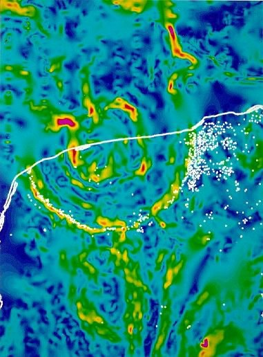

*Réponse publiée [sur Quora](https://fr.quora.com/Est-il-possible-que-les-dinosaures-soient-morts-à-cause-d-un-soudain-manque-d-oxygène/answer/Nick-Lemay-2)*

[Inversion du champ magnétique terrestre — Wikipédia](w:Inversion_du_champ_magnétique_terrestre) :

> Cependant, l'analyse statistique ne suggère aucune corrélation entre les inversions et les extinctions

[Extinction Crétacé-Paléogène — Wikipédia](w:Extinction_Crétacé-Paléogène) :

> "Avant les [années 1970](w:), les causes envisagées pour la disparition des dinosaures étaient :
>
>
>
> - …
> - une [inversion du champ magnétique terrestre](w:).
>
>
>
> Ces anciennes théories sont aujourd'hui très minoritaires dans le monde scientifique, voire complètement abandonnées, car :
>
>
>
> - …
> - des inversions du champ magnétique terrestre se sont produites maintes fois avant et après dans l'histoire géologique de la Terre, sans catastrophe de grande ampleur.

D'autre part

> D'autres chercheurs avancent que l'extinction a été plus progressive, résultant de changements plus lents du niveau de la mer ou du climat.
>
>
>
> Toutefois, les [paléobotanistes](w:Paléobotanique), notamment les [palynologues](w:Palynologie) étudiant le pollen, semblent avoir montré au niveau de la limite K-Pg, et plus particulièrement sur les sites nord-américains, que l'extinction a été rapide et cohérente avec l'hypothèse d'un impact : disparition quasi instantanée du pollen d'angiospermes dominant au Maastrichien, fern spike (« pic des fougères ») coïncidant avec le pic d'iridium, végétation opportuniste (fougères le plus souvent) puis réapparition progressive de gymnospermes puis d'angiospermes, et reconstitution progressive de la biodiversité

Enfin le [Cratère de Chicxulub](w:)est très bien connu:

> Il a été provoqué par la collision d'un [astéroïde](w:) de 11−81 km de diamètre qui s’est abattu sur la [Terre](w:), il y a 66 038 000 ans ± 11 000 ans selon les analyses radiométriques de haute précision réalisées en 2013

Vous noterez la précision de la datation.

> Le diamètre du cratère, d’environ 180 kilomètres, laisse imaginer une puissance d'explosion similaire à « plusieurs milliards de fois celle de la [bombe d’Hiroshima](w:Bombardements_atomiques_d'Hiroshima_et_de_Nagasaki) ». Le bassin du cratère, enseveli sous environ mille mètres de calcaire, s'étend pour moitié sous la terre ferme, et pour moitié sous le golfe du Mexique

Image :

> Carte des anomalies gravimétriques de la structure d'impact de Chicxulub. Le littoral est représenté par une ligne blanche. Une série frappante de caractéristiques concentriques révèle l'emplacement du cratère. Les points blancs représentent des gouffres remplis d'eau (caractéristiques d'effondrement de solution communes dans les roches calcaires de la région) appelés cenotes après le mot maya dzonot. Un anneau dramatique de cénotes est associé à la plus grande caractéristique périphérique de gradient de gravité. L'origine de l'anneau de cénote reste incertaine, bien que le lien avec le cratère enfoui sous-jacent semble clair.

Même quand vous pensez dire des choses basées sur des faits, vérifiez les svp car les connaissances évoluent très vite.
