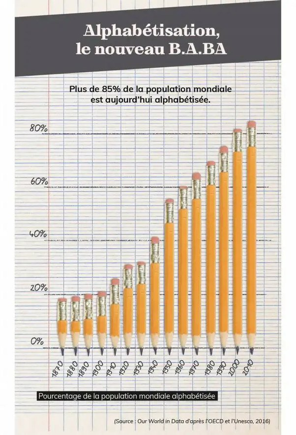

*Réponse publiée [sur Quora](https://fr.quora.com/Comment-est-il-possible-que-lhumanité-soit-si-confiante-envers-sa-technologie-au-point-den-être-totalement-dépendante/answer/Dr-Goulu)*

Quand même…

[L'incroyable alphabétisation du monde](https://www.lepoint.fr/societe/l-incroyable-alphabetisation-du-monde-10-09-2019-2334818_23.php)
