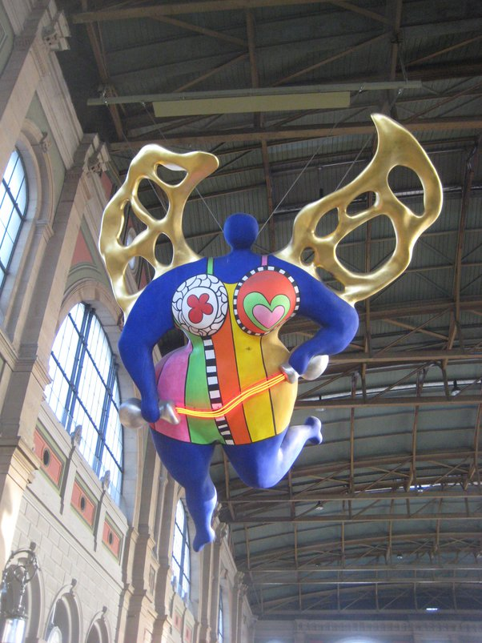

*Réponse publiée [sur Quora](https://fr.quora.com/Quelle-est-votre-femme-artiste-favorite-peinture-et-sculpure/answer/Dr-Goulu)*

J'ai tout de suite pensé à Camille Claudel, mais à la réflexion, je dirais

[https://fr.wikipedia.org/wiki/Ni...](w:Niki_de_Saint_Phalle)

J'adore ses énormes "nanas" colorées, comme cet ange dans la gare de Zurich :

Je la suspecte fortement d'être à la base des éléments rigolos des sculptures mobiles de son mari, Jean Tinguely. J'aime beaucoup Tinguely aussi, mais ses œuvres sont souvent noires, parfois morbides.

Niki, c'est la vie, la couleur, la joie.
