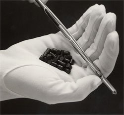
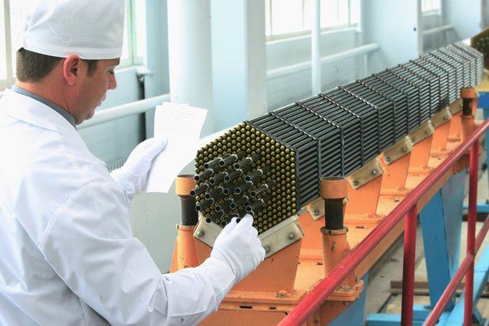
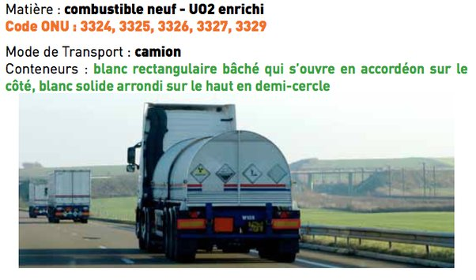
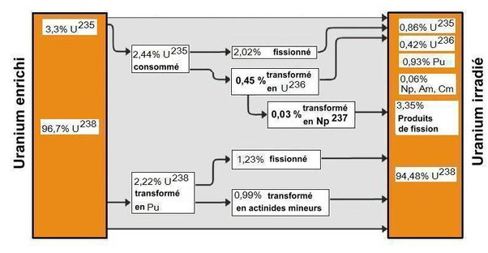

*Réponse publiée [sur Quora](https://fr.quora.com/Comment-l-uranium-est-il-transport%C3%A9/answer/Dr-Goulu)*

Comme vous voulez ou presque. Un transpalette est conseillé parce que c'est lourd…

L'[uranium](w:) naturel (238) ressemble à du plomb, vous pouvez le tenir dans les mains, ou l'entasser (il n'y a pas de "masse critique" avec le 238)

(le monsieur porte des gants parce que l'Uranium est un "métal lourd", chimiquement toxique, comme le plomb d'ailleurs…)

Ensuite on l'enrichit légèrement (à 3.3%) en Uranium 235 et on en fait des pastilles

qui sont introduites dans des "crayons" qui sont [montées dans des barres](w:Assemblage_combustible) :

On met ça dans un camion "normal", la radioactivité est très faible.

La seule image que j'ai trouvé provient d'un site antinucléaire :

Après on met beaucoup d'assemblages dans une centrale nucléaire, et quelques Térawattheures plus tard, on les ressort pour les ramener dans une usine de retraitement.

Là c'est beaucoup plus délicat, dangereux, blindé etc. Mais pas à cause de l'Uranium, à cause des ~5% d'autres isotopes que la fission a produits :

L'Usine de retraitement va recycler les 94.5% d'U238 et les 0.86% d'U235, vendre (ou donner…) le 1% de Plutonium à ses militaires préférés en leur disant "si vous n'aviez pas été là, on aurait fait le nucléaire au thorium…", et stocker le reste comme elle peut.

[https://www.drgoulu.com/2014/05/...](https://www.drgoulu.com/2014/05/24/bure-pour-leternite/#.YEFAKGhsOCo)
