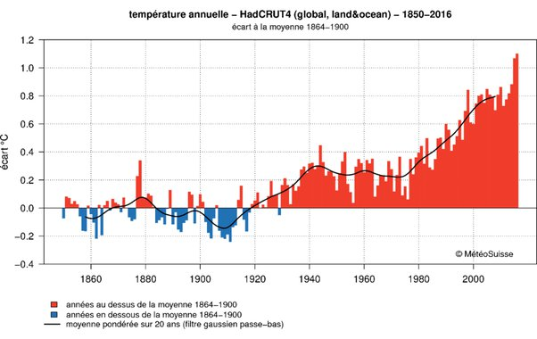

*Réponse publiée [sur Quora](https://fr.quora.com/Pourquoi-la-temp%C3%A9rature-de-la-plan%C3%A8te-a-t-elle-diminu%C3%A9-de-1880-%C3%A0-1910/answer/Dr-Goulu)*

disons plutôt qu'elle a varié dans 0.2°C en dessous de la moyenne 1864–1900 pendant cette période :

([source MeteoSuisse](https://www.meteosuisse.admin.ch/home/climat/climat-mondial/changement-climatique-mondial.html), qui a un très bon blog meteo/climat)

Au début de la période que vous mentionnez, il y a eu [la célèbre éruption du Krakatoa en 1883:](w:Éruption_du_Krakatoa_en_1883)

> Le panache de cendres volcaniques est monté à quatre-vingts kilomètres dans l'atmosphère et a répandu suffisamment de particules pour abaisser la température mondiale moyenne de 0,25 °C l'année suivante, avec une amplitude allant d'approximativement 0,18 à 1,3 °C. Les modèles climatiques continuent à être chaotiques durant quelques années, et les températures ne reviennent à la normale qu'après 1888 ([Wikipedia](w:Éruption_du_Krakatoa_en_1883))

Ensuite, la période 1900–1920 correspond à un minimum de l'

[https://fr.wikipedia.org/wiki/Os...](w:Oscillation_atlantique_multidécennale)

dont on s'est aperçu[[1]](#vzwRa) qu'elle avait une influence beaucoup plus large, notamment sur la mousson en Inde.

Et comme vous allez demander "alors pourquoi on ne la remarque pas pendant le minimum suivant en 1960–1990 ?", je vais déjà vous répondre : regardez bien la première figure en haut sur cette période…

Le réchauffement anthropique ne remplace pas les phénomènes naturels, il s'y ajoute. Au début du 20ème siècle il était plus faible que les effets naturels, il est désormais nettement dominant.

Notes de bas de page

[[1]](#cite-vzwRa)[The early 20th century warming: Anomalies, causes, and consequences](https://www.ncbi.nlm.nih.gov/pmc/articles/PMC6033150/)
