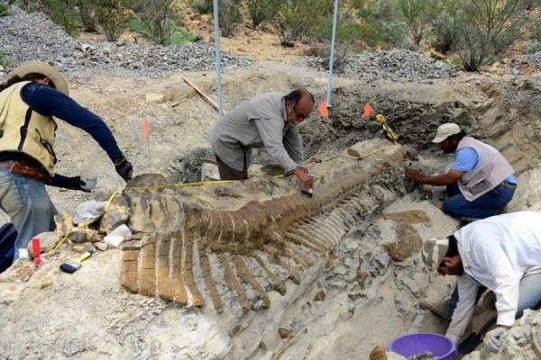
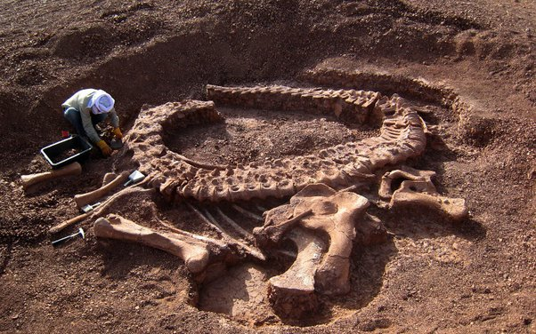
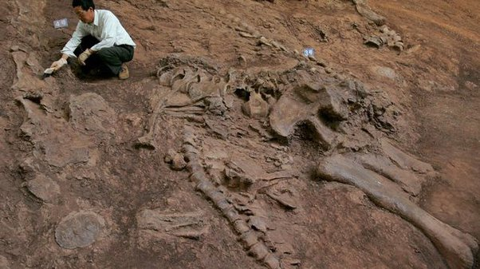
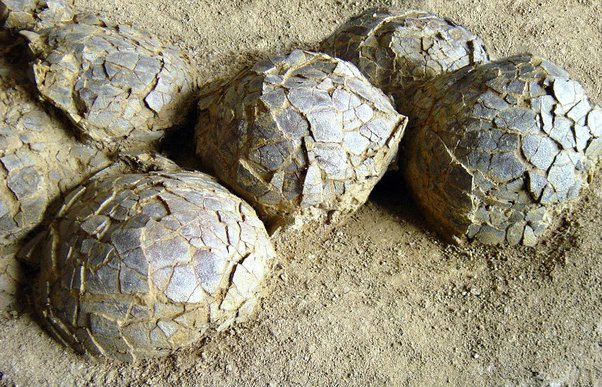
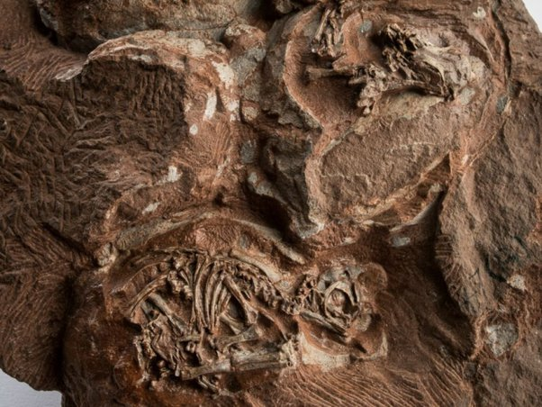
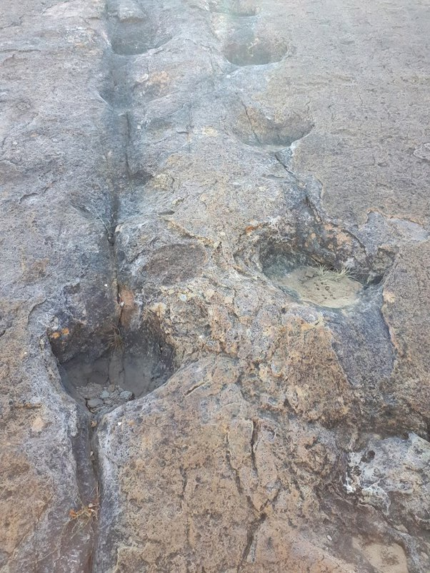

*Réponse publiée [sur Quora](https://fr.quora.com/Quelles-sont-les-preuves-que-les-dinosaures-ont-r%C3%A9ellement-exist%C3%A9/answer/Dr-Goulu)*

([Blandine Poitel](https://fr.quora.com/profile/Blandine-Poitel) , là tu peux mettre un Obélix qui se fend la malle, moi je vais partir de l'étrange idée que la question est sérieuse …)

On a juste trouvé des centaines de fossiles de centaines d'espèces, et des milliers de traces un peu partout.

Ici je vous mets que quelques photos de gros dinosaures comme on les retrouve dans la nature, bien avant qu'on les expose dans des musées où, c'est vrai, parfois on les arrange ou les complète pour faire plus joli pour les visiteurs :

(queue d'[hadrosauridé](w:Hadrosauridae), Mexique, 72 millions d'années [[1]](#XjAkM) )

([Tazoudasaurus](w:), Maroc[[2]](#iLJtb) )

( ?, Chine [[3]](#bascO) )

On a aussi trouvé des choses qui peuvent difficilement être autre chose que des œufs :

( France, 71 à 65 millions d'années[[4]](#qpExm) )

d'ailleurs quand on les passe aux rayons X on voit ça[[5]](#kTCbu) :

pour la bonne bouche, je vous mets une photo que j'ai prise moi-même :

On dirait des traces d'hippopotame dans la boue toute fraîche, mais la photo a été faite en Bolivie, à 3000m d'altitude environ dans le parc national de [Torotoro](w:Parc_national_Torotoro).

C'est un site exceptionnel car on y trouve plusieurs couches superposées de traces d'animaux différents à différentes époques. Et ça, s'il n'y avait eu qu'un seul Déluge, on aurait de la peine à l'expliquer…

Notes de bas de page

[[1]](#cite-XjAkM)[Une longue queue de dinosaure découverte au Mexique](https://www.20minutes.fr/planete/1191397-20130723-20130723-longue-queue-dinosaure-decouverte-mexique)

[[2]](#cite-iLJtb)[Le plus vieux dinosaure du monde à Ouarzazate](https://www.bladi.net/dinosaure-ouarzazate.html)

[[3]](#cite-bascO)[Une nouvelle espèce de dinosaure à plumes découverte en Chine](https://www.lexpress.fr/actualite/sciences/une-nouvelle-espece-de-dinosaure-a-plumes-decouverte-en-chine_1559672.html)

[[4]](#cite-qpExm)[Les fouilles - Musée parc des dinosaures de Mèze](https://www.musee-parc-dinosaures.com/fouilles/)

[[5]](#cite-kTCbu)[Des détails sans précédent de l'intérieur d'œufs de dinosaures fossilisés](https://www.futura-sciences.com/planete/actualites/paleontologie-details-precedent-interieur-oeufs-dinosaures-fossilises-6843/)
