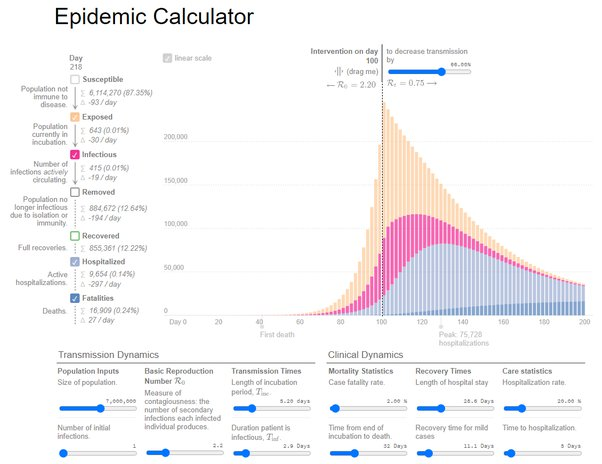

*Réponse publiée [sur Quora](https://fr.quora.com/Qui-peut-me-prouver-scientifiquement-que-devoir-prendre-rendez-vous-pour-faire-ses-courses-en-Belgique-va-diminuer-le-nombre-de-morts-de-la-Covid/answer/Dr-Goulu)*

Jouez avec

[http://gabgoh.github.io/COVID/in...](http://gabgoh.github.io/COVID/index.html)

vous allez voir cet écran:

Jouez avec le curseur horizontal en haut à droite pour augmenter de 1% les mesures de réduction de la transmission du virus.

Ca sauve des centaines de personnes de la mort.

Vous pouvez modifier tous les autres facteurs d'une épidémie comme vous voulez, la réduction des contacts entre personnes a un effet de réduction des infections, donc des malades, donc des morts.

1% ça n'a l'air de rien, mais à l'échelle d'un pays ce sont des centaines de vies.
