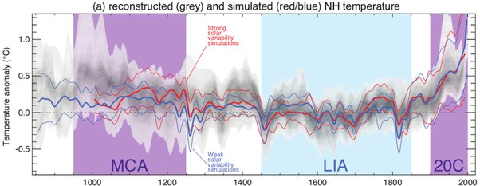

*Réponse publiée [sur Quora](https://fr.quora.com/À-quel-point-la-planète-sest-elle-réchauffée-depuis-la-période-préindustrielle/answer/Paul-Henri-Doumenc)*

c'est quoi votre "Source météo France pour l'ensemble du globe" ?

Moi sur le site de Meteo France je trouve ça : [Planète : le changement climatique observé](https://meteofrance.com/changement-climatique/observer/le-changement-climatique-observe-dans-le-monde)

avec cette image

qui montre que ce qui se passe depuis un siècle n'a rien à voir avec le millénaire précédent.

Et sur leur page [Impact des activités humaines sur le réchauffement climatique](http://www.meteofrance.fr/climat-passe-et-futur/comprendre-le-climat-mondial/387) on peut lire :

"Ainsi, en prenant uniquement en compte les facteurs de variabilité naturelle du système climatique (volcanisme, rayonnement solaire et variabilité interne), les modèles montrent des résultats assez proches des observations... mais seulement jusqu'à la moitié du XXe siècle. Au-delà, les températures observées sont bien supérieures à celles simulées par le modèle.

Seule l'intégration des gaz à effet de serre anthropiques (liés aux activités humaines) dans le modèle permet de faire correspondre les données simulées et les mesures réelles.

L'analyse ne s'arrête pas aux températures moyennes de la surface de la planète. Elle concerne aussi les changements de température à l'échelle des continents, en altitude dans l'atmosphère ou encore dans les premières centaines de mètres de l'océan. Dans l'état actuel des connaissances, la conclusion est simple : il est extrêmement probable* que plus de la moitié de l'augmentation observée de la température moyenne à la surface du globe entre 1951 et 2010 est due à l'augmentation anthropique des concentrations de gaz à effet de serre et à d'autres forçages anthropiques conjugués."

Donc ne faites pas dire à Météo France ce que vous serez bientôt seul à dire.
