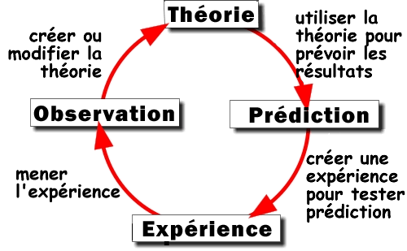

*Réponse publiée [sur Quora](https://fr.quora.com/Pourquoi-considérons-nous-des-idées-comme-la-téléportation-limmortalité-la-vision-à-distance-et-dautres-idées-similaires-comme-des-pseudosciences-Laviation-nétait-elle-pas-une/answer/Dr-Goulu)*

je pense que vous vouliez publier une réponse, pas un commentaire de la mienne… d'ailleurs votre lien mène à la question …

Effectivement les "idées" n'ont pas beaucoup de valeur en science. Ce qui est scientifique, ce sont les connaissances obtenues en suivant la [Méthode scientifique](w:) :

