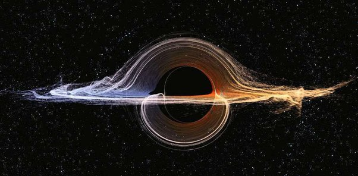

*Réponse publiée [sur Quora](https://fr.quora.com/Est-il-possible-qu-on-d%C3%A9couvre-une-r%C3%A9gion-de-l-espace-suffisamment-courb%C3%A9e-pour-nous-renvoyer-notre-propre-lumi%C3%A8re-nous-permettant-d-observer-notre-syst%C3%A8me-solaire-dans-le-pass%C3%A9/answer/Dr-Goulu)*

Oui. Autour d'un trou noir, la lumière est dévié d'un angle dépendant de sa distance radiale au trou. Cet angle est de plus en plus élevé jusqu'à la [Sphère de photons](w:) où elle tourne en rond (déviation infinie)

Il y a donc une distance radiale précise où la lumière est déviée de 180°, donc renvoyée vers l'observateur.

[Alain Riazuelo](http://www2.iap.fr/users/riazuelo/index.php) a pas mal étudié ça et simulé ces images aujourd'hui célèbres où vous pouvez voir la Voie Lactée "copiée" et retournée plusieurs fois autour d'un trou noir de Schwarzschild (= qui ne tourne pas) :

[https://www.youtube.com/watch?v=...](https://www.youtube.com/watch?v=UvVULEcFBVs)

Il en a fait ensuite d'autres pour un trou noir de Kerr (= en rotation) ce qui rend les choses un peu moins claires, mais l'effet est toujours là :

[https://www.youtube.com/watch?v=...](https://www.youtube.com/watch?v=gfYidqhizpk)

Evidemment, un vrai trou noir a très probablement un disque d'accrétion en plus, et dans ce cas vous vous retrouvez la fameuse figure du film Interstellar qui ressemblait à ça :

Dans cette figure, le disque d'accrétion est horizontal mais vous le voyez aussi au dessus et au dessous du trou noir car la lumière émise par la partie du disque "cachée" derrière le trou noir est déviée d'environ 90°.

Donc la zone où la lumière fait un 180°C pour vous revenir serait à l'intérieur de cette image du disque d'accrétion, et là ce sera pas facile de l'isoler.

[https://www.science-et-vie.com/a...](https://www.science-et-vie.com/archives/trous-noirs-voici-a-quoi-ils-ressemblent-vraiment-21088)

Mais dans cette image désormais célèbre de [M87*](w:), il y a peut-être un ou deux photons qui ont fait l'aller-retour depuis la Voie Lactée en 107 millions d'années :

