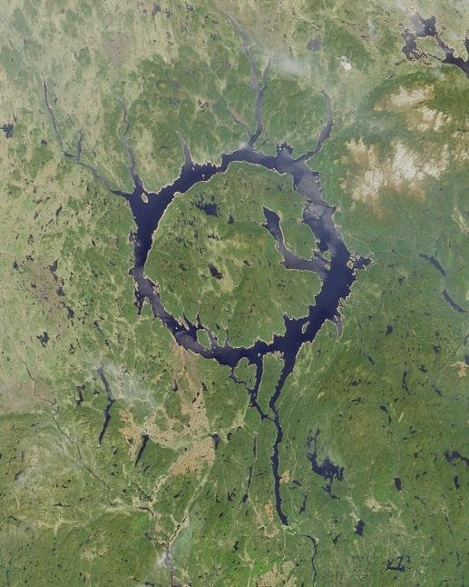

*Réponse publiée [sur Quora](https://fr.quora.com/Quel-crat%C3%A8re-r%C3%A9sultant-dun-impact-m%C3%A9t%C3%A9orique-est-il-le-plus-impressionnant-sur-la-plan%C3%A8te-Terre/answer/Dr-Goulu)*

Moi j'aime bien celui là :

Le lac de Manicouagan au Québec fait 72 km de diamètre. Il est partiellement artificiel, puisqu’il est formé par le barrage [Manic-5](w:Centrale_Manic-5) que l’on devine au bas de la photo, sur la rivière coulant vers le Sud, mais remplit un cratère formé lors d'un impact il y a 214 millions d'années.

Et on connaît 7 autres impacts du même âge, bien alignés sur la Pangée de l'epoque, dont un à Rochechouart, mais ils sont moins jolis.

[https://www.drgoulu.com/2009/04/...](https://www.drgoulu.com/2009/04/16/de-manicouagan-a-rochechouart/)
