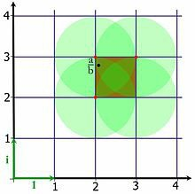

*Réponse publiée [sur Quora](https://fr.quora.com/Le-quotient-de-deux-entier-de-gauss-est-il-n%C3%A9cessaire-un-entier-de-gauss/answer/Dr-Goulu)*

Dans C non, mais dans l'[Anneau euclidien](w:) des [Entiers de Gauss](w:Entier_de_Gauss), oui.

"il suffit de " définir la division de deux entiers de Gauss ainsi :

> Soit a et b deux entiers de Gauss tels que b soit non nul, alors il existe un couple d'entiers de Gauss tel que :
>
>
>
> ${\displaystyle a=bq+r\quad {\text{avec}}\quad N(r)<N(b).~}$
>
>
>
> Illustrons la division euclidienne par un exemple :
>
>
>
>
>
> $${\displaystyle {\begin{aligned}a&=-36+242\mathrm {i} \\b&=50+50\mathrm {i} \\{\frac {a}{b}}&={\frac {103}{50}}+{\frac {139}{50}}\mathrm {i} \end{aligned}}}$$
>
>
>
>
>
> L'objectif est de trouver un entier de Gauss q proche de *a* / *b*. Par proche on entend que le reste de la division soit de norme plus petite que la norme de b. Une autre manière d'exprimer la division euclidienne est de dire que la distance entre *a* / *b* et q est strictement inférieure à 1.
>
>
>
> 
>
>
>
> Dans l'illustration, le carré contenant *a* / *b* est mis en valeur par un fond rouge. Les quatre sommets du carré sont alors candidats à être solution de la division euclidienne. Chaque sommet est le centre d'un cercle de rayon un, dont l'intersection du disque intérieur avec le carré rouge indique la zone où la division est possible. On remarque que tout point du carré est couvert par au moins un cercle. Plus précisément les points près du centre sont couverts par quatre cercles, une zone près de chaque sommet est couverte par trois cercles, le reste du carré, autour des côtés, par deux cercles à l'exception des sommets, couverts par un unique cercle.
>
>
>
> En conclusion, la division euclidienne admet toujours de une à quatre solutions, la solution est unique si et seulement si *a* / *b* est un entier de Gauss. Dans notre exemple, les trois solutions acceptables sont :
>
>
>
>
>
> $${\displaystyle s_{1}=2+3\mathrm {i} \quad s_{2}=2+2\mathrm {i} \quad s_{3}=3+3\mathrm {i} .}$$
>
>
>
>
>
> L'unicité de la solution n'est pas si importante, les entiers de Gauss forment un anneau euclidien.
