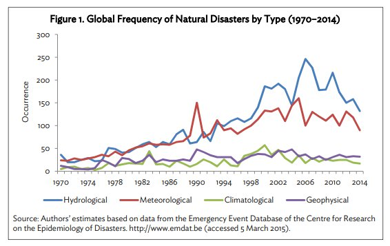
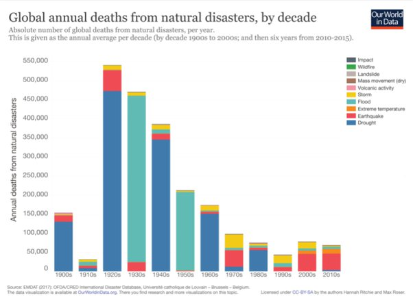

*Réponse publiée [sur Quora](https://fr.quora.com/La-fr%C3%A9quence-des-catastrophes-naturelles-sintensifie-t-elle/answer/Dr-Goulu)*

La

[https://www.emdat.be/](https://www.emdat.be/)

permet de répondre à cette question par "oui mais elles font moins de morts".

Ce rapport :

[https://reliefweb.int/sites/reli...](https://reliefweb.int/sites/reliefweb.int/files/resources/global-increase-climate-related-disasters.pdf)

montre cette figure :

sur laquelle on voit en effet une forte augmentation des catastrophes hydrologiques (inondations) et des événements météorologiques en 40 ans de données fiables (satellites etc…) C'est moins net pour les événements climatiques (sécheresses + ?) et pour les volcans + tremblements de terre

Mais sur

[https://ourworldindata.org/natur...](https://ourworldindata.org/natural-disasters)

on trouve ce graphique tiré des données de l'EM-DAT:

qui montre une baisse très nette du nombre de victimes alors que la population mondiale a été multipliée par 4 dans le même temps.

Notez que la plupart des morts étaient causées par des famines consécutives aux sécheresses et/ou inondations, alors que ces causes ont quasiment disparu depuis les années 1990, peut-être par chance, mais peut-être aussi parce que l'irrigation s'est améliorée et que l'aide alimentaire fonctionne dans ces cas là maintenant.

Les tremblements de terre sont les catastrophes qui font le plus de victimes depuis 2000, mais pas plus que dans les années 20 où il y avait 4x moins d'humains sur Terre.

Par contre on commence à voir poindre une nouvelle catégorie : les températures extrêmes …
