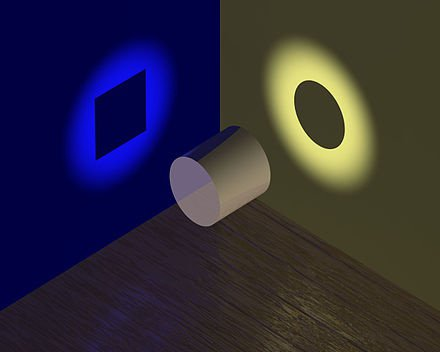

*Réponse publiée [sur Quora](https://fr.quora.com/De-quelle-façon-un-électron-tourne-t-il-lorsquil-est-suspendu-dans-le-vide/answer/Dr-Goulu)*

oui vous décrivez assez bien cette illustration qu'on trouve souvent sur la dualité onde/particule

Mais je ne suis pas d'accord avec "La véritable réalité de l'électron (et autres) est très certainement autre et d'un niveau de complexité qui nous échappe encore totalement. "

Si c'était le cas, il y aurait des phénomènes physiques liés à l'électron qui ne seraient pas décrits par la théorie. Ce n'est pas le cas. On sait notamment exactement pourquoi les orbitales ont ces formes, on peu même expliquer pourquoi l'or est jaune à partir de ses orbitales.

La MQ décrit très bien tout ce que fait un électron dans toutes les situations connues.

La "véritable réalité de l'électron" , franchement, en physique on s'en tape. Une fois qu'on a une description mathématique correcte, on laisse l'os de la "véritable réalité" à ronger aux philosophes.
