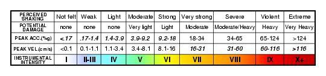
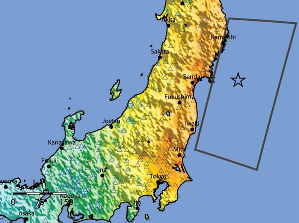

*Réponse publiée [sur Quora](https://fr.quora.com/Quelle-est-la-diff%C3%A9rence-entre-un-tremblement-de-terre-de-magnitude-5-et-8-en-terme-de-magnitude-et-en-terme-de-force/answer/Dr-Goulu)*

Sur l'échelle de [Magnitude de moment](w:) qui remplace l'échelle de Richter à laquelle elle correspond à peu près, un degré de magnitude correspond à une augmentation d'un facteur √1000 (environ 31,6) de l'[énergie](w:) libérée.

Donc un séisme de magnitude 8 dégage 31,6^3 = 31600 fois plus d'énergie qu'un séisme de magnitude 5.

Maintenant si vous vous intéressez à la "force", il faut tenir compte de la distance de l'épicentre à laquelle vous vous trouvez, et utiliser l'[échelle Medvedev-Sponheuer-Karnik](http://www.wikipedia.org/search-redirect.php?language=fr&go=Go&search=échelle Medvedev-Sponheuer-Karnik) (MSK) qui mesure l'intensité par l'accélération du sol enregistrée par les sismographes. Pour éviter la confusion avec l'échelle de moment, on numérote cette échelle en chiffres romains :

Sur la carte ci-dessous, vous voyez la "shake map" du tremblement de terre qui a causé le tsunami de Sendai en 2011, avec les couleurs qui correspondent à l'échelle MSK ci-dessus :

Ce tremblement de Terre de magnitude 9 (magnitude de Moment) a causé des dégâts d'intensité VII à VIII sur la côte près de Fukushima.

En regardant l'échelle, on voit que le niveau VIII correspond à des accélérations du sol de 34 à 65% de g, l'accélération terrestre.

Prenons 50% pour la suite. Ce tremblement de Terre a donc créé, à Fukushima, une force d'environ 500 grammes-force sur chaque kilo posé au sol. 50 kg sur moi, pas facile de rester debout …

En Suisse, où nous avions une centrale nucléaire du même type que Fukushima, les barrages et les centrales sont conçues pour supporter un séisme d'intensité IX, où l'accélération peut atteindre 1g. Dans un tel séisme, les objets non fixés au sol décollent, et peuvent subir 2x leur poids.

Ca paraît impressionnant, mais c'est assez facile de faire une (petite) structure qui résiste à ça. Ce qui est plus difficile, c'est de faire que les vibrations du sol, qui sont d'une fréquence, d'une direction et d'une durée difficile à anticiper, ne fassent pas résonner certains modes propres du bâtiment ou de l'installation, et que le sol sur lequel ils sont construits résiste.

C'est en général ceci qui renverse des bâtiments pourtant conçus "antisismiques", comme par exemple à Kobe en 1995 où un séisme de magnitude 7.2 "seulement" mais situé juste sous la ville a causé des dégâts de magnitude IX à X …

Pour rappel, les centrales nucléaires de Fukushima ont bien supporté le tremblement de terre, qui n'a causé qu'une panne d'électricité très courte avant que des génératrices ne prennent le relais. C'est le tsunami qui a suivi et inondé les génératrices qui a causé la catastrophe.

[https://www.drgoulu.com/2011/03/...](https://www.drgoulu.com/2011/03/16/seismes-et-energies/#.YJMGkLWiGCo)
