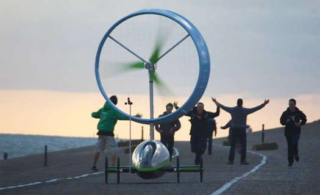

*Réponse publiée [sur Quora](https://fr.quora.com/%C3%89tait-il-possible-pour-les-navires-%C3%A0-voiles-dautrefois-de-se-d%C3%A9placer-dans-une-direction-exactement-oppos%C3%A9e-%C3%A0-celle-du-vent/answer/Dr-Goulu)*

Non, et d'ailleurs ce n'est toujours pas possible sans [louvoyer](w:) même avec les voiliers ultra-modernes actuels. Ils remontent au vent beaucoup mieux que leurs ancêtres, mais comme la force générée par une voile est une portance aérodynamique, elle est par définition au mieux perpendiculaire à la vitesse du vent, mais l'inévitable traînée dévie la résultante vers l'arrière.

Entre parenthèses, si on arrivait à trouver un profil d'aile ou de voile qui avait une résultante dirigée vers l'avant, il n'y aurait plus besoin de moteurs aux avions, et les éoliennes tourneraient sans vent : [mouvement perpétuel !](/2012/05/27/dites-non-au-mouvement-perpetuel/#.YJeVDrWiGCo)

En fait un bateau peut remonter face au vent [avec une éolienne](https://www.youtube.com/watch?v=IzGCYaJbf0A) qui actionne une hélice.

Sur terre, ce véhicule arrive à remonter face au vent à 58% de la vitesse de celui-ci

Mais encore plus extraordinaire, sur terre un véhicule peut aller plus vite que le vent au vent arrière ! Et ça c'est aussi impossible pour un voilier.

La première fois que j'ai vu ça, j'ai pensé à une arnaque au mouvement perpétuel de plus :

[https://youtu.be/5CcgmpBGSCI](https://youtu.be/5CcgmpBGSCI)

Mais non, c'est juste très très fûté …

[https://www.drgoulu.com/2012/12/...](/2012/12/16/encoreplus-vite-que-le-vent/#.YJeT6rWiGCo)
