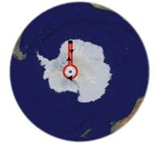

*Réponse publiée [sur Quora](https://fr.quora.com/Quel-endroit-sur-Terre-présente-les-phénomènes-les-plus-étranges/answer/Hugo-Thierry)*

il y a une autre réponse : à 23,183 km du pôle sud. En descendant 20 km au sud il arrivera à 3.183 km du pôle, puis en allant tout droit vers l’est il décrira un cercle parfait de 20 km de périmètre avant de rejoindre son campement en marchant plein nord sur le chemin par lequel il est arrivé !

[De quelle couleur est l'ours ? - Pourquoi Comment Combien](https://www.drgoulu.com/2013/10/08/de-quelle-couleur-est-lours/#.YJlf97WiGCo)
