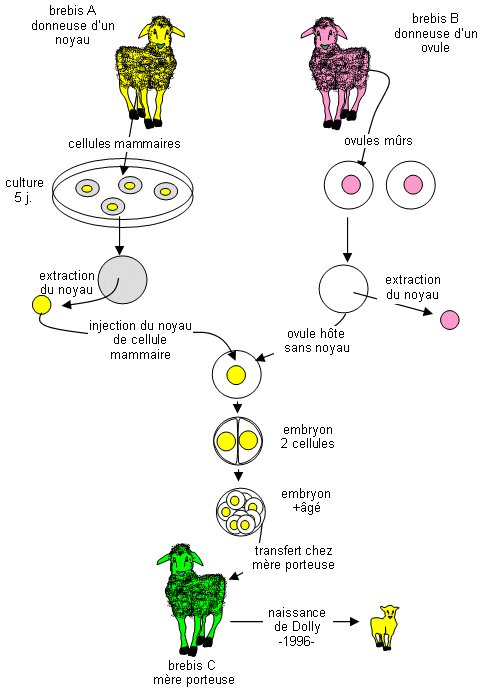

*Réponse publiée [sur Quora](https://fr.quora.com/Pensez-vous-quil-sera-possible-un-jour-de-fabriquer-des-spermatozo%C3%AFdes-artificiels-ou-de-mettre-une-femme-enceinte-sans-avoir-besoin-de-spermatozo%C3%AFdes/answer/Dr-Goulu)*

Ça a été fait chez les brebis depuis 1996 et d'autres animaux ensuite : on injecte un noyau cellulaire dans une ovule et il n y a carrément plus besoin de fécondation, donc de spermatozoïde.

(l' "image sensible" ci-dessous est un dessin schématique contenant une brebis jaune, une rose et une verte… je vous aurai prévenu !)

Le [Clonage humain](w:)a été interdit par L'ONU en 2005, mais il est très probable qu'il se fasse un jour, légalement ou pas.
