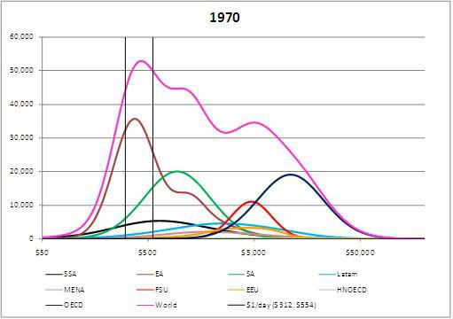
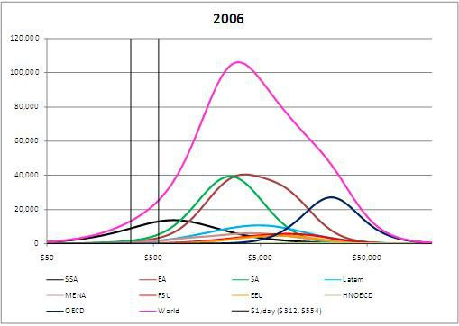
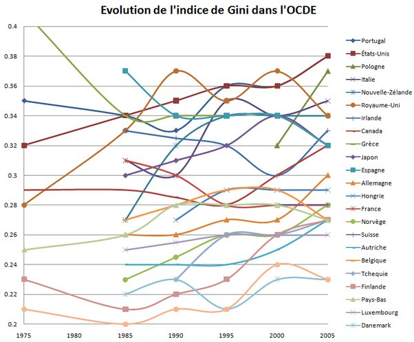
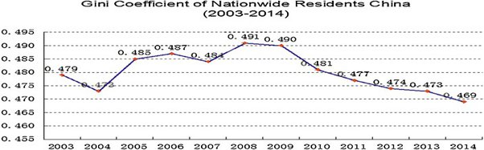

*Réponse publiée [sur Quora](https://fr.quora.com/Le-creusement-des-in%C3%A9galit%C3%A9s-dans-le-monde-est-il-soutenable-Si-non-y-a-t-il-une-solution-cr%C3%A9dible-le-mot-cr%C3%A9dible-est-important/answer/Dr-Goulu)*

Au niveau du monde entier, **les inégalités se réduisent**par le fait que les pays "émergeants" ont eu une croissance économique rapide qui a comblé le fossé entre le "Tiers-Monde" (qui n'existe plus) et les pays développés :

en 2006, la courbe des revenus dans le monde est beaucoup plus "normale" (en échelle log…) qu'en 1970, et l'[indice de Gini](w:Coefficient_de_Gini) qui est la meilleure mesure des inégalités est très clairement en baisse, ainsi que la pauvreté.

(source : [Parametric estimations of the world distribution of income](https://voxeu.org/article/parametric-estimations-world-distribution-income) )

Cependant il est vrai que les inégalités intérieures ont augmenté dans pas mal de pays, mais ce n'est pas le cas partout, et ça varie au cours du temps. En 2009 j'avais obtenu ce graphique sur la base des données de l'OCDE[[1]](#pfiKk) :

qui montre que les inégalités ont augmenté sur cette période surtout dans les pays anglo-saxons (et ça continue…) mais diminué dans certains pays, dont la France. Où la situation a changé, les données de l'INSEE montrent une hausse ces dernières années.[[2]](#RbJXv)

Mais dans d'autres pays, et pas des moindres comme la Chine, les inégalités sont en baisse. Mais à un niveau très élevé, surtout pour un pays communiste…

Source : [China's income inequality in the global context](https://www.sciencedirect.com/science/article/pii/S2213020915000518)

Plus sur ce sujet :

[https://www.drgoulu.com/tag/ineg...](https://www.drgoulu.com/tag/inegalites/#.YKIHnaiiGCo)

Notes de bas de page

[[1]](#cite-pfiKk)[Combien d'inégalité ? - Pourquoi Comment Combien](https://www.drgoulu.com/2009/03/21/combien-dinegalite/#.YKIFiqiiGCo)

[[2]](#cite-RbJXv)[Quarante ans d’inégalités de niveau de vie et de redistribution en France (1975-2016)](https://www.insee.fr/fr/statistiques/4238443?sommaire=4238781)
