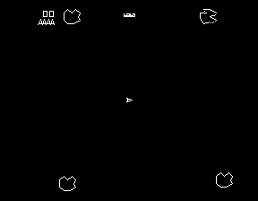
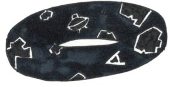

*Réponse publiée [sur Quora](https://fr.quora.com/Si-notre-univers-est-en-forme-de-tore-qui-a-til-a-lint%C3%A9rieur-et-Ducoup-autour/answer/Dr-Goulu)*

Il faut bien comprendre ce que signifie "univers torique". Pour simplifier, regardons un univers torique à 2 dimensions :

L'Univers du jeu [Asteroids](w:)est torique parce que les objets qui "sortent" par le haut "entrent" par le bas et vice-versa, et que les bords gauches et droits sont reliés de la même façon.

Enroulez donc l'écran pour faire correspondre la gauche et la droite, et le haut et le bas et vous obtenez… tadddaaaaaammm !

un tore !

(source : [Asteroids on a Donut](https://infinityplusonemath.wordpress.com/2017/02/18/asteroids-on-a-donut/) )

vous allez dire : ouais mais là l'écran est plat, et on voit bien le tore en 3D donc ça marche pas avec l'univers …

Mais

1. le pilote du vaisseau Asteroids qui vit dans le plan de l'écran ne perçoit pas la courbure de son univers, encore moins la discontinuité quand il passe d'un bord de l'écran à l'autre. Remarquez que l'univers/écran n'a ainsi plus de bords, il n'y a pas d' "extérieur"
2. Si on raccordait l'avant et l'arrière d'un écran 3D holographique on aurait un hypertore en 3D. Il n'a pas de bords, et pas d'extérieur. L'intérieur est l'Univers, ensemble de tout ce qui existe…

Ce modèle a été proposé en 1984 par by [Alexei Starobinsky](w:en:Alexei_Starobinsky) et [Yakov Borisovich Zel'dovich](w:en:Yakov_Borisovich_Zel'dovich)

[https://en.wikipedia.org/wiki/Th...](w:en:Three-torus_model_of_the_universe)

mais balayé par Stephen Hawking en 1992 comme étant instable[[1]](#iyVnn)

De tels modèles ont cependant été étudiés, y compris des topologies plus complexes dans lesquelles on devrait voir plusieurs copies d'un même objet si l'univers n'est pas trop grand

[https://fr.wikipedia.org/wiki/Un...](w:Univers_en_tore_bidimensionnel)

En passant : l'univers torique d'Astéroïd était généré dans une mémoire d'ordinateur linéaire, comme les univers 3D des jeux actuels d'ailleurs. Ca fait réfléchir sur la notion de dimension non ?

Peut-être qu'à très petite échelle, la 3D de notre univers se ramène à de la 2D voire de la 1D …

[https://www.drgoulu.com/2011/08/...](/2011/08/13/selon-newton-lunivers-serait-digital/#.YKJoeKiiGCo)

Notes de bas de page

[[1]](#cite-iyVnn)[The Simpson-Hawking Donut Universe](http://klotza.blogspot.com/2016/01/the-simpson-hawking-donut-universe.html)
