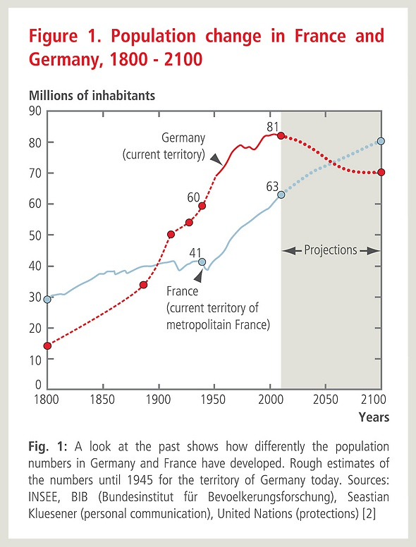

*Réponse publiée [sur Quora](https://fr.quora.com/Pourquoi-nous-dominons-et-exterminons-tous-les-autres-êtres-vivants-de-cette-planète-sans-nous-remettre-en-question/answer/Dr-Goulu)*

vous voyez les guerres mondiales I et II ? ce sont les deux petits trous sur la population française, le 2ème étant partiellement un rebond du premier (déficit des naissances 14–18 se reportant pile une génération plus tard )

Effectivement, la grippe espagnole est incluse dans le premier petit trou de population, mais elle n'a pas tué que dans les pays en guerre : la mortalité a été de 3.9 pour mille en France, 4 à 5 en Allemagne , mais 5.9 en Suisse et 9.7 au Portugal pour ne parler que de l'Europe (chiffres trouvés dans [THE GEOGRAPHY AND MORTALITY OF THE 1918 INFLUENZA PANDEMIC on JSTOR](https://www.jstor.org/stable/44447656?seq=1#metadata_info_tab_contents) )

Globalement, quand on regarde les courbes ci-dessus, l'effet des 2 guerres mondiales + épidémie + famine sur la population des principaux belligérants est : néant. Je ne nie pas que d'anciennes guerres aient provoqué des famines locales et temporaires, mais les nuages de sauterelles et les intempéries le faisaient plus souvent…

On verra si Jancovici et les autres collapsologues ont raison. De toutes manières, et ils le disent eux-mêmes, c'est déjà trop tard pour changer. Personnellement je pense que l'humanité est dans des changements si rapides que les extrapolations ne sont plus valables, si tant est qu'elles l'aient été un jour …
